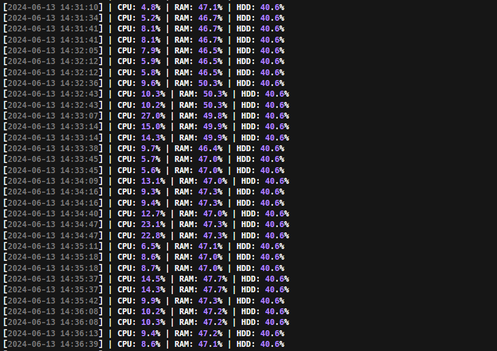
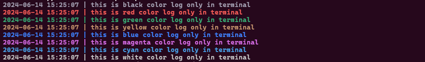
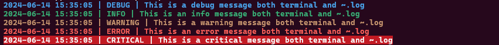
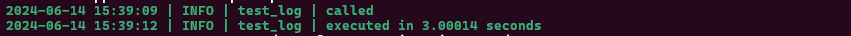
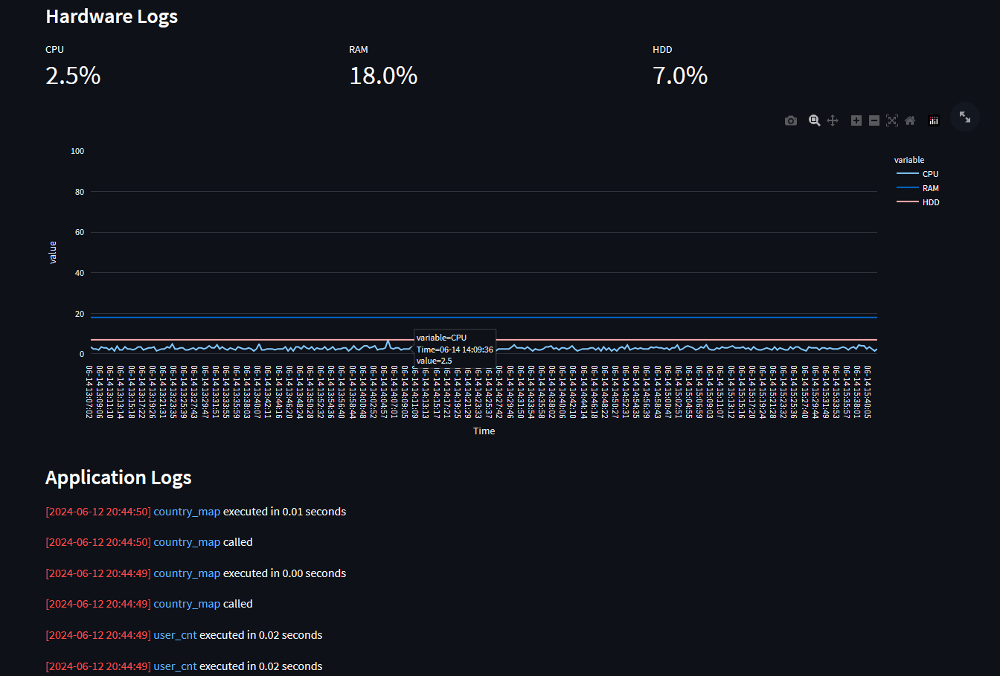

# Logger

로거 모듈은 개발 및 배포 후 유지보수를 위해 효율적인 로깅을 제공합니다. 모니터링 모듈과 함께 사용하면 앱 관리를 더욱 효율적으로 할 수 있습니다. 주요 기능은 다음과 같습니다.

# Table of Contents

1. [Logger](#logger)
2. [Main Features](#main-features)
3. [Requirements](#requirements)
4. [Usage](#usage)
5. [Testing](#testing)
6. [Applications](#applications)


## Main Features

### 하드웨어 로깅
CPU, RAM, SSD/HDD 상태를 실시간으로 확인하여 시스템의 CPU 부하나 메모리 부하를 로깅합니다.

### 시스템 로깅
DEBUG, INFO, WARNING, ERROR, CRITICAL 레벨로 로그를 분리하여 계층별로 확인할 수 있습니다.

### 실행 시간 측정
동기/비동기 함수 위에 데코레이터로 사용하여 함수의 실행 시간을 측정할 수 있습니다.

### 컬러 로그
가독성을 위해 특정 색상을 활용하여 로그를 출력할 수 있습니다. 지원 색상: BLACK, RED, GREEN, YELLOW, BLUE, MAGENTA, CYAN, WHITE


## Requirements

### .env 파일 구성
```text
LOGGING_LEVEL = <LOGGING_LEVEL> # DEBUG, INFO, WARNING, ERROR, CRITICAL 중 하나 선택
SYSTEM_LOGGER_PATH = <YOUR SYSTEM LOGGER PATH>
HARDWARE_LOGGER_PATH = <YOUR HARDWARE LOGGER PATH>
SHOW_LOGGER_TIMESTEP = "True" # 날짜 및 시간 로깅 여부
SAVE_LOGGER_FILE = "True" # 시스템 로깅 저장 여부
```


## Usage

### 하드웨어 로깅
#### main.py에 종속되어 사용하는 경우:
```python
import hw_logger
hw_logger.start_hw_logger()
```

#### 독립적으로 실행하는 경우:
```bash
python hw_logger.py
```

위와 같이 사용하게 되면 .env 파일의 `<HARDWARE_LOGGER_PATH>/hw.log`로 하드웨어 로그가 아래 이미지와 같이 적용됩니다.


### 시스템 로깅

main.py 에서 아래와 같이 로깅 설정을 import 합니다:
```python
from logger_config import log_execution_time, logger, log
```

컬러 로그를 활용할 때는 log 함수에 색상과 내용을 인자로 입력합니다:
```python
log('black', 'this is black color log only in terminal')
log('red', 'this is red color log only in terminal')
log('green', 'this is green color log only in terminal')
log('yellow', 'this is yellow color log only in terminal')
log('blue', 'this is blue color log only in terminal')
log('magenta', 'this is magenta color log only in terminal')
log('cyan', 'this is cyan color log only in terminal')
log('white', 'this is white color log only in terminal')
```

이렇게 하면 아래와 같은 결과를 얻을 수 있습니다:


logger로 로깅할 때는 아래와 같이 활용합니다:
```python
logger.debug("This is a debug message both terminal and ~.log")
logger.info("This is an info message both terminal and ~.log")
logger.warning("This is a warning message both terminal and ~.log")
logger.error("This is an error message both terminal and ~.log")
logger.critical("This is a critical message both terminal and ~.log")
```

이렇게 하면 아래와 같은 결과물을 얻을 수 있습니다:


함수의 실행 시간을 측정하고 싶을 때는 아래와 같이 활용합니다:
```python
@app.get("/test_log_execution_time")
@log_execution_time
async def test_log():
    time.sleep(3)
    return 'success'
```

이렇게 하면 아래와 같은 결과물을 얻을 수 있습니다:



## Testing
```bash
cd logger
pip install -r requirements.txt
python main.py
```


## Applications
아래 모니터링 모듈과 함께 활용하면 아래와 같이 쉽게 모니터링 시스템을 구축할 수 있습니다.  
[Monitoring 바로가기](https://github.com/jki0113/Cutsom-Utils/tree/main/monitoring)

