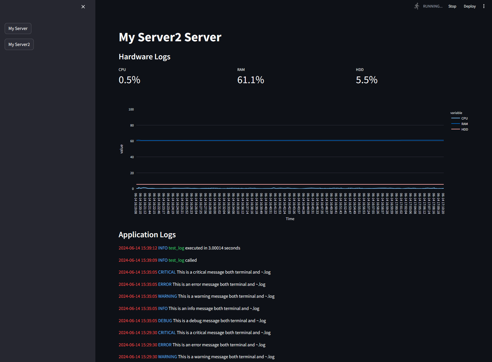

# Monitoring
모니터링 모듈은 개발 및 배포 후 로깅 및 하드웨어 정보에 대한 모니터링 대시보드를 제공합니다.

이 서버 모니터링 대시보드는 Streamlit을 사용하여 서버의 하드웨어 및 애플리케이션 로그를 시각화하는 애플리케이션입니다. 이 대시보드를 통해 최신 300개의 로그 데이터를 시각적으로 확인할 수 있으며, 여러 서버 설정을 쉽게 추가하고 선택할 수 있습니다.


## How to run

이 프로젝트에 필요한 패키지들을 설치하려면, 다음 명령어를 사용하세요:

```bash
pip install -r requirements.txt
```

### Settings

`config.py` 파일을 사용하여 서버의 설정을 관리할 수 있습니다. 예를 들어, 다음과 같이 서버를 설정할 수 있습니다:
```python
servers = [
    {
        "name": "My Server",
        "hw_log_url": "/path/to/hw.log",
        "sys_log_url": "/path/to/sys.log"
    },
    {
        "name": "My Server2",
        "hw_log_url": "/path/to/hw2.log",
        "sys_log_url": "/path/to/sys2.log"
    }
]

monitoring_config = {
    'MAX_LOG_COUNT': 300,
}
```

### run
설정이 완료되면, 아래의 명령어로 Streamlit 서버를 실행하여 대시보드를 볼 수 있습니다:

```bash
streamlit run monitor.py
```
브라우저가 자동으로 열리며, 아래와 같이 사이드바에서 다른 서버를 선택하여 해당 서버의 로그 데이터를 확인할 수 있습니다.
